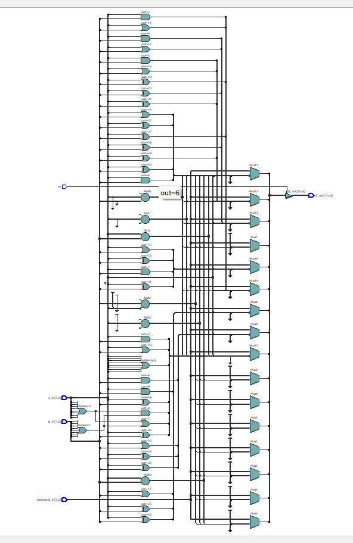
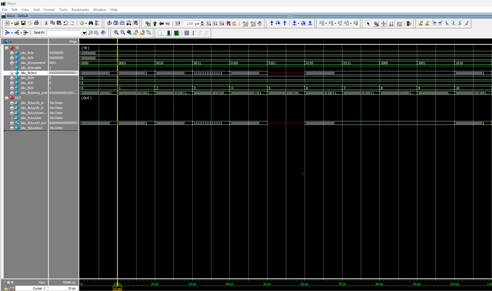

# Arithmetic Logic Unit (ALU)

## Description

A versatile 8-bit Arithmetic Logic Unit (ALU) that supports 16 different operations including arithmetic operations (addition, subtraction, multiplication, division, increment, decrement), logical operations (AND, OR, NAND, NOR, XOR, XNOR, NOT, BUFFER), and shift operations (left shift, right shift).

The ALU accepts two 8-bit operands and produces a 16-bit result with output enable control for tri-state functionality.

## Port Specifications

### Inputs
| Port | Width | Description |
|------|-------|-------------|
| `a_in` | 8 bits | First operand |
| `b_in` | 8 bits | Second operand |
| `command_in` | 4 bits | Operation selector (0x0 - 0xF) |
| `oe` | 1 bit | Output Enable (tri-state control) |

### Outputs
| Port | Width | Description |
|------|-------|-------------|
| `d_out` | 16 bits | Result output (high-impedance when oe=0) |

## Supported Operations

| Command | Opcode | Operation | Description |
|---------|--------|-----------|-------------|
| ADD | 4'b0000 | a_in + b_in | Add two 8-bit operands |
| SUB | 4'b0001 | b_in - a_in | Subtract a_in from b_in |
| MUL | 4'b0010 | a_in × b_in | Multiply two operands |
| DIV | 4'b0011 | b_in ÷ a_in | Divide b_in by a_in |
| INC | 4'b0100 | a_in + 1 | Increment a_in by 1 |
| DEC | 4'b0101 | a_in - 1 | Decrement a_in by 1 |
| SHL | 4'b0110 | a_in << 1 | Shift a_in left by 1 bit |
| SHR | 4'b0111 | a_in >> 1 | Shift a_in right by 1 bit |
| AND | 4'b1000 | a_in & b_in | Bitwise AND |
| OR | 4'b1001 | a_in \| b_in | Bitwise OR |
| INV | 4'b1010 | ~a_in | Bitwise NOT (invert a_in) |
| NAND | 4'b1011 | ~(a_in & b_in) | Bitwise NAND |
| NOR | 4'b1100 | ~(a_in \| b_in) | Bitwise NOR |
| XOR | 4'b1101 | a_in ^ b_in | Bitwise XOR |
| XNOR | 4'b1110 | ~(a_in ^ b_in) | Bitwise XNOR |
| BUF | 4'b1111 | a_in | Buffer (pass-through) |

## File Structure

```
ALU/
├── RTL/
│   └── alu.v              # RTL implementation
├── Sim/                   # Simulation directory
├── Synthesis/             # Synthesis directory
├── tb/
│   ├── alu_tb.v          # Testbench
│   └── alu                # Compiled simulation executable
└── README.md             # This file
```

## Simulation

### Running the Simulation

1. **Compile the design:**
   ```bash
   iverilog -o alu RTL/alu.v tb/alu_tb.v
   ```

2. **Run the simulation:**
   ```bash
   vvp alu
   ```

3. **View waveforms (optional):**
   ```bash
   gtkwave alu.vcd &
   ```

### Testbench Details

The testbench (`alu_tb.v`) should verify:
- All 16 operations produce correct results
- Tri-state output behaves correctly (high-impedance when `oe=0`)
- Proper handling of edge cases (division by zero, overflow conditions)

## Design Characteristics

- **Input Width:** 8 bits
- **Output Width:** 16 bits (supports results up to 65535)
- **Operations:** 16 different arithmetic, logical, and shift operations
- **Output Control:** Tri-state output enable (`oe`)
- **Logic Style:** Combinational (asynchronous)

## Notes

- When `oe = 0`, the output is tri-stated (high-impedance state: `16'bz`)
- When `oe = 1`, the computed result is driven on the output
- Division by zero causes undefined behavior (a_in = 0 in DIV operation)
- Subtraction: SUB operation performs (b_in - a_in), not (a_in - b_in)
- Increment/Decrement operations ignore the b_in input

## Example Usage

```verilog
// Add 5 + 3
a_in = 8'd5;
b_in = 8'd3;
command_in = 4'b0000;  // ADD
oe = 1'b1;
// d_out = 16'd8

// AND operation: 0xFF & 0x0F
a_in = 8'hFF;
b_in = 8'h0F;
command_in = 4'b1000;  // AND
oe = 1'b1;
// d_out = 16'h000F
```

## Synthesis - ModelSIM 



## WAVEFORMS



> Simulated waveforms showing ALU inputs, command signals, and output results for various operations.
