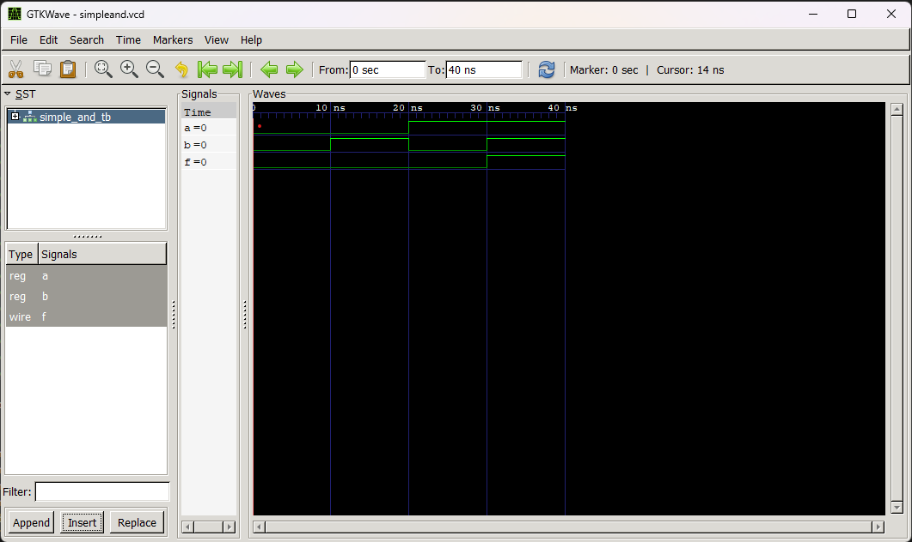

# AND Gate

## Description
The AND gate is a basic digital logic gate that produces an output of 1 only when both inputs are 1. Otherwise, the output is 0.

## Files
- `simple_and.v` - RTL implementation of the AND gate
- `simple_and_tb.v` - Testbench for AND gate simulation
- `simpleand.vcd` - Waveform data file (VCD format)
- `mysim` - Compiled simulation executable

## Truth Table

| Input A | Input B | Output |
|---------|---------|--------|
| 0       | 0       | 0      |
| 0       | 1       | 0      |
| 1       | 0       | 0      |
| 1       | 1       | 1      |

## Simulation

### How to Run
```bash
iverilog -o mysim simple_and.v simple_and_tb.v
vvp mysim
gtkwave simpleand.vcd
```

### Expected Results
The simulation verifies that the AND gate correctly implements the truth table logic for all input combinations.

## Waveform


> Waveform image showing input signals A and B, and the corresponding output across multiple test cycles. The output goes HIGH only when both inputs are simultaneously HIGH.

